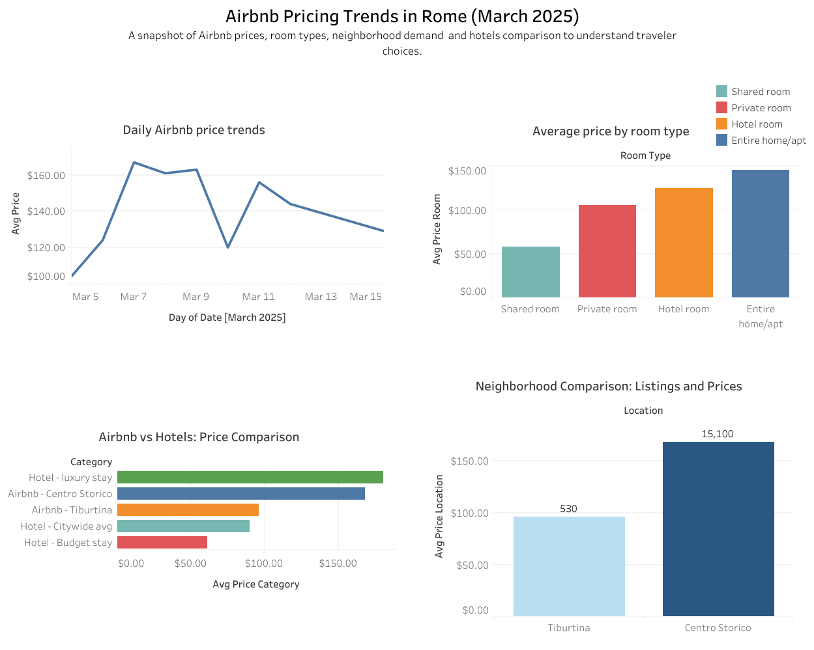

#**Business Task:**
Rome has become one of the most popular cities for short-term rentals among travelers. With Airbnb prices rising in recent years, travelers face an important question. What drives these prices, and what are their alternatives?
To better understand these changes, this case study analyzes Airbnb pricing trends in Rome, Italy, to uncover patterns by date, room type, and location and draw conclusions from it.

#####**Objectives**
- Analyze Airbnb listing data in Rome.
- Identify pricing patterns by date, room type, host status, and location.
- Use hotel averages as a comparison to show alternatives.
- Provide insights for travelers to help them make smart decisions and match their budget.

**Data Sources**
- Airbnb: Inside Airbnb (Rome, March 2025). Chosen to capture the shoulder season (outside peak summer).
- Hotels: BudgetYourTrip (Rome, 2025). Averages do not reflect daily fluctuations completely accurate.

**Data Cleaning**
- Removed irrelevant columns and kept key variables such as price, room types, date and location.
- Converted price column to numeric format in Excel for cleaning and aggregation purposes.
- Filtered out extreme outliers (luxury stays over $800).
- Prepared dataset for Excel, SQL queries and Tableau.

**Analysis & Insights**
1. **Daily Price Trends**
- Average price: $140
- Median price: $112
- Lowest day: March 5th at $104 (Wednesday)
- Highest day: March 7th at $167 (Friday / Francesca Romana Day / Jubilee event)
Insight: Events and weekends drive sharp price spikes. Travelers on a budget may find hotels more attractive during these peaks.

2. **Room Type Price Average and Ratings**
- Shared room:  $58 average with a rating of 4.7
- Private room: $106 average with a rating of 4.6
- Hotel room (via Airbnb): $125 average with a rating of 4.6
- Entire apartment: $146 average with a rating of 4.7
Insight: Entire apartments cost the most but achieve high satisfaction. Shared rooms are cheapest, yet ratings remain high.

3. **Location Pricing**
- Centro Storico: $150 average with 15,000 listings (tourist area)
- Tiburtina: $90 average with 500 listings (outside tourist area)
Insight: Central tourist areas are about $60 more expensive than less touristy neighborhoods.

4. **Airbnb vs. Hotels**
- Airbnb in Centro Storico: $150 average
- Airbnb in Tiburtina: $96 average
- Hotels citywide avg: $90 average
Insight: Airbnbs in central touristy areas are significantly more expensive than hotels. In neighborhoods like Tiburtina, which are away from the touristy areas, Airbnb aligns more closely with hotel averages.

**Key Findings Summary**
- Airbnb pricing in Rome varies widely by location, room type, and event and weekend demands.
- Central tourist areas are significantly pricier than the city average.
- Guest satisfaction remains consistently high regardless of room type and accommodations.
- Hotels provide price stability and serve as a useful alternative for travelers flying on a budget.

**Dashboard**
The snapshot below summarizes all trends. Click the link to explore interactively.

**Interactive Dashboard**
[View Interactive Dashboard](https://public.tableau.com/views/AirbnbPriceTrends/AirbnbCaseStudy?:language=en-US&:sid=&:redirect=auth&:display_count=n&:origin=viz_share_link)

**Recommendations**
* **Choose neighborhoods strategically**. Travelers on a budget should look beyond the touristy areas such as the historic center. Areas like Tiburtina or other non-touristy zones offer listings that are often $50 to $60 cheaper per night while still providing good accomodations.
* **Plan around events and weekends**. Prices spike during local festivals or holidays so checking out what is going on during dates and booking early or shifting travel dates by a day or two can lead to major savings.
* **Always Compare with hotels during peak demand**. When Airbnb surges above $150 in central areas, hotels usually provide more stable, affordable alternatives. A quick hotel comparison worthwhile looking at.
* **Entire apartments provide privacy but at the highest cost**. Travelers comfortable with private rooms and with shared rooms can save significantly without losing much in satisfaction so its a good alternative, especially for solo travelers.

**Tools Used**
- SQL (Data cleaning & analysis)
- Visual Studio Code (logging insights and key findings)
- Tableau (Dashboard visuals)
- Excel (cleaning, analyzing and formatting)

